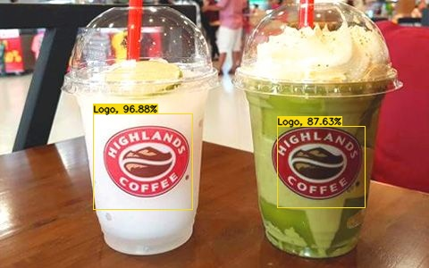

## Brand And Logo Detection In Image Using Yolov3

### 1.Introduction:

This repo is an implementation of our project: "**Image and Brand Detection In Image**" in course: "**Data Mining**".

### 2.Requirements:

- Python: 3.6
- Tensorflow == 1.14.0
- Tensorflow-gpu == 1.14.0

To install this project's package dependencies please type command

    pip install -r requirements.txt

### 3.Running Demo:

Please download the checkpoint of our model in Link

- cd to our project working directory

- type command

        python test_image.py --input_image YOUR_IMAGE_PATH --restore_path CHECKPOINT_PATH

Some Result

### 4.Dataset:

We use **Open Logo** dataset for training Yolov3 Model

- Training: 75% dataset
- Validate: 25% dataset 

Dataset Paper: https://arxiv.org/abs/1807.01964

This dataset you can download in https://qmul-openlogo.github.io/

### 5.Experiments:

Our project got 42.5 % mAP (mean Average Precision) on validation set
